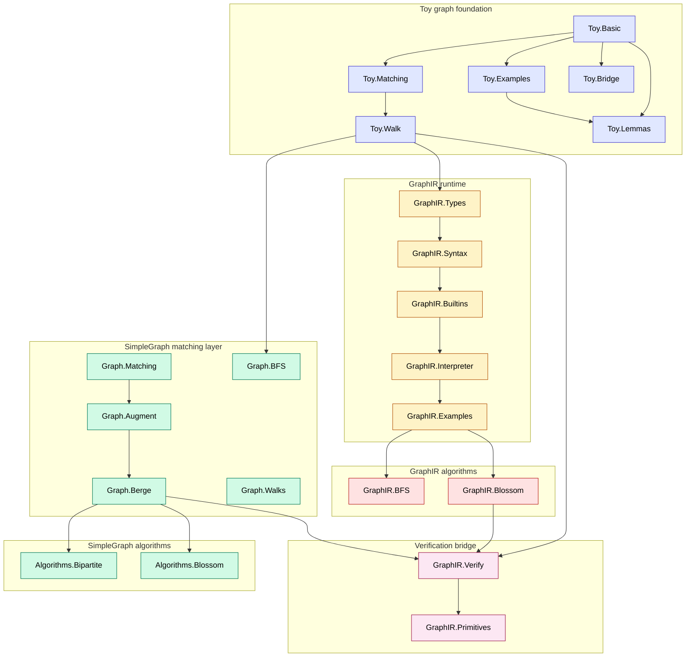
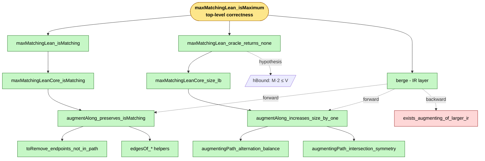

# Hackathon — Formalizing Edmonds' Blossom in Lean 4

Solution submitted by **Team Blossom** for the **UW Lean Hackathon 2026**.

A from-scratch Lean 4 + Mathlib formalization of matching theory and Edmonds' blossom algorithm, accompanied by a small custom intermediate representation (**GraphIR**) for writing and verifying graph algorithms.


## Headline Results

- **Closed augmentation lemma** — `IsAugmenting.xorWith_isMatching` and `IsAugmenting.xorWith_card` are both proved in [`Hackathon/Graph/Augment.lean`](Hackathon/Graph/Augment.lean). Given an `M`-augmenting walk `w`, the symmetric difference `M △ E(w)` is again a matching and has exactly one more edge than `M`.
- **Berge's theorem (SimpleGraph)** — `berge` in [`Hackathon/Graph/Berge.lean`](Hackathon/Graph/Berge.lean) proves "M maximum ↔ no M-augmenting path"; the forward direction is fully closed by the augmentation lemma, the backward direction reduces to one named obligation.
- **Berge's theorem (IR)** — `berge` in [`Hackathon/GraphIR/Blossom.lean`](Hackathon/GraphIR/Blossom.lean) proves the analogous iff at the IR layer; uses the proved `augmentAlong_preserves_isMatching` + `augmentAlong_increases_size_by_one`.
- **Loop termination** — `maxMatchingLean_oracle_returns_none` proves that the matching loop (fuel `|V|/2 + 1`) returns a matching on which the oracle reports `none`, given the size bound `|M|·2 ≤ |V|`. Combined with Berge, this yields `maxMatchingLean_isMaximum`.
- **GraphIR primitive correctness** — `augment_correct_spec` and `contract_matching_correct_spec` in [`Hackathon/GraphIR/Primitives.lean`](Hackathon/GraphIR/Primitives.lean) prove that the IR implementations of `augmentAlong` and `Matching.contract` agree with the Lean reference definitions at sufficient fuel.
- **BFS soundness** — `bfsLean_sound` in [`Hackathon/GraphIR/BFS.lean`](Hackathon/GraphIR/BFS.lean) proves every `(v, d)` returned by the BFS reference corresponds to a real `Toy.Walk` of length `d`. Optimality is closed for the `v = s` subcase via the helpers `bfsLean_dist_unique` and `bfsLean_start_in_result`.
- **Augment / Contract on IR** — `augmentingPath_alternation_balance`, `augmentingPath_intersection_symmetry`, and `augmentAlong_preserves_isMatching` in [`Hackathon/GraphIR/Blossom.lean`](Hackathon/GraphIR/Blossom.lean) are all fully proved.

**Status:** 4 deep sorries remain (Berge backward in both layers, BFS optimality `v ≠ s` case, blossom-contraction equivalence). All are research-level graph theorems with structural helpers in place.

## Compilation

Standard Lake package (Lean 4.29.1 + Mathlib v4.29.1):

```bash
lake update     # one-time: fetch deps and Mathlib build cache
lake build      # build everything (3346 jobs, clean)
```

To measure compilation time and report build status / `sorry` count in one shot:

```bash
./scripts/measure-build.sh
```

The script prints a human-readable summary and also writes a machine-readable report to `build-report.json` (elapsed time, exit status, error count, `sorry`-warning count, per-file `sorry` breakdown). It is the primary signal consumed by the autoresearch loop described below.

## Project Structure

```
Hackathon/
├── Graph/                       — SimpleGraph (Mathlib) layer
│   ├── Matching.lean            — IsAugmenting, IsAlternating
│   ├── Augment.lean             — xorWith, the augmentation lemma
│   ├── Berge.lean               — Berge's theorem
│   ├── Walks.lean               — walk lemmas
│   ├── Toy/                     — toy graph framework + bridge to Mathlib
│   └── Algorithms/
│       ├── Bipartite.lean       — Hungarian / Hopcroft–Karp scaffold
│       └── Blossom.lean         — Edmonds scaffold
├── GraphIR/                     — Custom intermediate representation
│   ├── Syntax.lean              — Expr / FunDecl / Program
│   ├── Types.lean               — Val and ValType
│   ├── Builtins.lean            — Context, primitive operations
│   ├── Interpreter.lean         — small-step evaluator with fuel
│   ├── Primitives.lean          — IR ↔ Lean equivalence proofs
│   ├── BFS.lean                 — BFS reference + soundness
│   ├── Blossom.lean             — blossom algorithm IR + correctness
│   ├── Verify.lean              — top-level reduction theorems
│   └── Examples.lean            — runnable example programs
└── Exercises/                   — pedagogical warm-ups (closed)
```

## Project Dependency Diagram

The codebase is layered: a from-scratch *toy* graph foundation, the Mathlib-flavoured *SimpleGraph* layer for matching theory, the *GraphIR* runtime (syntax → builtins → interpreter), the *GraphIR* algorithms (BFS, blossom), and finally the *verification bridge* that ties IR programs back to the Lean reference proofs.



Reading the diagram: arrows are `import` edges. The verification bridge (`Verify.lean` and `Primitives.lean`) pulls in *both* the IR's `Blossom.lean` and the SimpleGraph layer's `Berge.lean`, so that IR-level correctness obligations can be discharged via the Lean-side proofs of Berge's theorem and the augmentation lemma.

## Proof Structure (IR layer)

The diagram below shows how the top-level theorem `maxMatchingLean_isMaximum` is reduced through Berge plus loop-termination obligations down to the proved augmentation-side lemmas. Green = proved in Lean, red = remaining `sorry`, yellow = main theorem.



## Proof Structure (SimpleGraph layer)

Mathlib-side Berge's theorem and its supporting helpers:

```mermaid
flowchart TD
    classDef proved fill:#c6f7c6,stroke:#1f6f1f,color:#000
    classDef sorrybox fill:#fed7d7,stroke:#9b1c1c,color:#000
    classDef main fill:#fde68a,stroke:#a16207,color:#000,font-weight:bold

    BMAIN([<b>berge - SimpleGraph</b><br/>M maximum ↔ no M-augmenting path]):::main

    BMAIN -. forward .-> X1[IsAugmenting.xorWith_isMatching]:::proved
    BMAIN -. forward .-> X2[IsAugmenting.xorWith_card]:::proved
    BMAIN -. backward .-> X3[exists_augmenting_of_larger]:::sorrybox

    X1 --> H1[interior_in_M_verts]:::proved
    X1 --> H2[M_partner_is_walk_neighbor]:::proved
    X1 --> H3[walk_edge_eq_support]:::proved

    X2 --> H4[list_filter_count_of_alternating_aux]:::proved
    X2 --> H5[walk_edges_set_ncard_eq]:::proved
    X2 --> H6[M_inter_walk_edges_ncard]:::proved

    BFS([bfsLean_optimal - partial]):::main
    BFS -. v=s case .-> B1[bfsLean_dist_unique]:::proved
    BFS -. v=s case .-> B2[bfsLean_start_in_result]:::proved
    BFS -. v≠s case .-> B3[BFS-layer invariant]:::sorrybox

    CON([contract_matching_augmenting_iff]):::main
    CON -. helpers .-> CT1[Matching.mem_contract_iff]:::proved
    CON -. helpers .-> CT2[mem_contract_of_outside_cycle]:::proved
    CON -. Edmonds .-> CT3[odd-cycle traversal]:::sorrybox
```



## Example 1 — The Augmentation Lemma

The heart of every matching algorithm: an `M`-augmenting walk produces a matching with one more edge. From [`Hackathon/Graph/Augment.lean`](Hackathon/Graph/Augment.lean):

```lean
/-- Adjacency in the symmetric difference of M with a walk:
    exactly one of "M.Adj a b" and "s(a,b) ∈ w.edges" holds. -/
def xorWith (M : G.Subgraph) {u v : V} (w : G.Walk u v) : G.Subgraph where
  verts := M.verts ∪ {x | x ∈ w.support}
  Adj a b := G.Adj a b ∧ (M.Adj a b ↔ s(a, b) ∉ w.edges)
  …

/-- xorWith is a matching when w is M-augmenting. -/
theorem IsAugmenting.xorWith_isMatching
    {M : G.Subgraph} (hM : M.IsMatching) {u v : V}
    {w : G.Walk u v} (hw : IsAugmenting M w) :
    (xorWith M w).IsMatching

/-- xorWith has exactly one more edge than M. -/
theorem IsAugmenting.xorWith_card
    {M : G.Subgraph} (hM : M.IsMatching) {u v : V}
    {w : G.Walk u v} (hw : IsAugmenting M w)
    (hMFin : M.edgeSet.Finite) :
    (xorWith M w).edgeSet.ncard = M.edgeSet.ncard + 1
```

`xorWith_isMatching` is proved by a 4-case dispatch on whether the vertex is already matched by `M` and whether its `M`-partner is on the walk; uses helpers `interior_in_M_verts`, `M_partner_is_walk_neighbor`, and `walk_edge_eq_support`. `xorWith_card` then counts: the walk has odd length `2k+1`, so `|xorWith| = |M| + (2k+1) − 2·k = |M| + 1`, via the helper `list_filter_count_of_alternating_aux`.

## Example 2 — Berge's Theorem (forward direction proved)

From [`Hackathon/Graph/Berge.lean`](Hackathon/Graph/Berge.lean):

```lean
theorem berge {M : G.Subgraph} (hM : M.IsMatching) (hMFin : M.edgeSet.Finite) :
    IsMaximumMatching M ↔
    ∀ {u v : V} (w : G.Walk u v), ¬ IsAugmenting M w := by
  constructor
  · -- (⇒) If M is maximum, no augmenting path exists.
    rintro ⟨_, hMax⟩ u v w hAug
    have h1 : (xorWith M w).IsMatching := hAug.xorWith_isMatching hM
    have h2 : (xorWith M w).edgeSet.ncard = M.edgeSet.ncard + 1 :=
      hAug.xorWith_card hM hMFin
    have h3 : (xorWith M w).edgeSet.ncard ≤ M.edgeSet.ncard := hMax _ h1
    omega
  · -- (⇐) Reduces to `exists_augmenting_of_larger` (Berge backward).
    intro hNoAug; refine ⟨hM, ?_⟩; intro M' hM'
    by_contra h; push_neg at h
    obtain ⟨_, _, w, hAug⟩ := exists_augmenting_of_larger hM hM' h
    exact hNoAug w hAug
```

The forward direction is **fully closed** using the augmentation lemma; the backward direction reduces to `exists_augmenting_of_larger` (the M△M' path-decomposition argument, the remaining sorry).

## Example 3 — Loop Termination & Maximum Matching

From [`Hackathon/GraphIR/Blossom.lean`](Hackathon/GraphIR/Blossom.lean): the bounded "augment until oracle says none" loop terminates with the oracle reporting `none`, given the standard `|M|·2 ≤ |V|` bound:

```lean
theorem maxMatchingLean_oracle_returns_none
    (ctx : Context V) (spec : OracleSpec ctx)
    (hBound : (maxMatchingLean ctx).size * 2 ≤ ctx.vertices.length) :
    findAugmentingPathLean ctx (maxMatchingLean ctx) = none
```

**Proof sketch:** A helper `maxMatchingLeanCore_size_lb` shows by induction on fuel that either the oracle reports `none` at the result, or the size has grown by `n` (the fuel consumed). Starting from the empty matching with fuel `|V|/2 + 1`, the second case would force `(maxMatchingLean ctx).size ≥ |V|/2 + 1`, contradicting `hBound`.

Combined with Berge (IR-level), this gives the top-level correctness:

```lean
theorem maxMatchingLean_isMaximum
    (ctx : Context V) (spec : OracleSpec ctx)
    (hBound : (maxMatchingLean ctx).size * 2 ≤ ctx.vertices.length) :
    IsMaximumMatching ctx (maxMatchingLean ctx)
```

## Example 4 — GraphIR Syntax

GraphIR is a small functional/SSA-style IR with a fuel-based interpreter. Every binding is a `let`, recursion is via top-level function declarations, and `f(args)` invokes either a built-in or user function. The textual surface syntax looks like ML / typed lambda calculus:

**A: sum of a list.** Recursion over a list with pattern matching:

```
sum(xs) =
  match xs with
  | []     => 0
  | h :: t => nat_add(h, sum(t))

main =
  sum([1, 2, 3])
```

Running it: `#eval Interp.run (cfg3 k3Ctx) 100 sumListProgram` ⇒ `some 6`.

**B: handshake lemma on K₃** — sum of degrees should equal `2·|E|`:

```
sumDeg(xs) =
  match xs with
  | []     => 0
  | h :: t => nat_add(graph_degree(h), sumDeg(t))

main =
  sumDeg(graph_vertices())
```

Running on the triangle K₃ ⇒ `some 6` (= 2·3, where |E|=3).

**C: BFS** — the actual program shown to the interpreter is the mutually-recursive trio below ([`Hackathon/GraphIR/BFS.lean`](Hackathon/GraphIR/BFS.lean)):

```
bfs_step(queue, dist) =
  match queue with
  | []             => dist                            // done
  | (u, d) :: rest =>
      process_ns(rest, dist, neighbors(u), d)

process_ns(queue, dist, ns, d) =
  match ns with
  | []        => bfs_step(queue, dist)
  | n :: rest =>
      if isSome(map_lookup(n, dist))                  // already visited
      then process_ns(queue, dist, rest, d)
      else
        let dist'  = map_insert(n, d+1, dist) in
        let queue' = list_append(queue, [(n, d+1)]) in
        process_ns(queue', dist', rest, d)

bfs(s) =
  bfs_step([(s, 0)], map_insert(s, 0, []))
```

Running BFS from vertex 0 on the path P₄ (0—1—2—3): `#eval Interp.run (cfg4 p4Ctx) 1000 (bfsProgram 0)` ⇒ `some [(v3, 3), (v2, 2), (v1, 1), (v0, 0)]`. The companion `bfsLean` is the pure-Lean reference; `bfsLean_sound` proves every returned `(v, d)` corresponds to a real walk of length `d`.

## Example 5 — IR ↔ Lean Reference Equivalence

To verify that IR programs compute what we claim, each major primitive has an "IR equals Lean reference" theorem. From [`Hackathon/GraphIR/Primitives.lean`](Hackathon/GraphIR/Primitives.lean):

```lean
/-- The IR's `augment` function (composition of edgesOf, filterOut, filterIn)
    computes the same matching as Lean's `Matching.augmentAlong`. -/
theorem augment_correct_spec (cfg : Config V) (M : List (V × V)) (P : List V) :
    ∃ fuel,
      Interp.eval cfg blossomFuns fuel env
        (c "augment" [matchingExpr M, pathExpr P]) =
      some (matchingVal (Matching.augmentAlong M P))

/-- The IR's `contract_matching` function computes the same as Lean's
    `Matching.contract`. -/
theorem contract_matching_correct_spec :
    ∃ fuel,
      Interp.eval … (c "contract_matching" [matchingExpr M, blossomExpr B]) =
      some (matchingVal (Matching.contract M B))
```

These reduce IR-side reasoning to Lean-side reasoning, so once the deep graph theorems are closed, the IR loop's correctness follows mechanically through `Verify.lean`.

## Proof Graph in Two Lines

We formalize graph theory from the ground up in Lean 4: vertices, edges, paths, walks, matchings, augmenting paths. On top of that foundation we design a small toy language (**GraphIR**) — explicit syntax and sound operational semantics — and implement Edmonds' blossom algorithm in it. The IR's correctness reduces (via `Verify.lean`) to a small set of graph-theoretic obligations (Berge's theorem, the augmentation lemma, blossom contraction).

## Autoresearch Pipeline

To accelerate proof development we built an **autoresearch loop** — a
fully-automated system that both *closes open `sorry` placeholders* and
*optimises compile time* of existing proofs, without human intervention.

Run with:
```bash
python scripts/autoresearch.py [target]            # sorry-filling mode
python scripts/autoresearch.py --optimize <file>   # optimize mode
python scripts/autoresearch_with_forcegraph.py --optimize <file>  # with D3 decision graph
```

### How it works

The pipeline runs in two complementary modes:

**Sorry-filling mode**

1. Scans every `.lean` file for tactic-mode `sorry` placeholders.
2. Extracts the live Lean *proof goal state* at each `sorry` by temporarily
   injecting `trace_state` and compiling the file.
3. Sends the file, the goal, and any previous failure feedback to Claude
   (Anthropic) asking for 3–5 candidate proof tactics.
4. Evaluates every candidate with `lake env lean` and keeps all that compile.
5. Ranks passing candidates by a **proof quality score** that penalises opaque
   automation (`simp`, `aesop`, `decide`) and rewards explicit mathematical
   structure (`have`, `exact`, `calc`, `rcases`).
6. Writes the best candidate back to disk and repeats until no `sorry`s remain
   or no progress is made.

**Optimize mode**

1. Measures the baseline compile time of the target file.
2. Detects any real compile errors and records their line numbers; blocks
   overlapping those lines are automatically skipped.
3. For each complete tactic proof block, asks Claude for refactored alternatives
   — conservative rewrites such as replacing bare `simp` with `simp only [...]`,
   extracting reasoning into named `have` blocks, or using explicit theorem
   applications instead of search tactics.
4. Ranks alternatives by the same quality score; accepts a change only if the
   new proof scores strictly better *and* introduces no new compile errors.
5. Writes the improved file, logs every change, and produces an interactive
   visualisation.

### Proof quality score

Lower is better. The score balances three signals:

```
score = 0.1 × compile_time
      + 2.0 × automation_cost    # penalise simp / aesop / decide / omega
      − 1.5 × structure_bonus    # reward have / exact / calc / rcases / refine
      + brevity_penalty           # mild penalty for one-liners
```

This biases the model toward readable, compositional proofs rather than
proof-golfed one-liners or giant `simp` calls.

### Decision-trace visualisation

Every run writes `proof-search.html` — an interactive force-directed graph
showing exactly which candidates were tried, why each failed or passed, and
why the chosen proof was selected over the alternatives.

> **Replace the placeholder below with a screen-recording gif of the graph.**


Each node is a colour-coded card:

| Colour | Meaning |
|---|---|
| 🟠 Orange | Search root (the `sorry` / theorem being worked on) |
| 🟢 Green ★ | Chosen proof — best quality score |
| 🔵 Blue | Passing candidate not selected |
| 🔴 Red | Failed to compile |
| ⚫ Grey | Banned (`sorry` / `admit` / `native_decide`) |

Hover any node for the full proof text, quality score, compile time, and
error message. Drag to rearrange; scroll to zoom.

### Optimization log

Every `--optimize` run writes a timestamped Markdown log to `logs/`.
Example entry from `Hackathon/Graph/Matching.lean`:

---

**`have h_first : (w.edges[0]'hpos) ∉ M.edgeSet := by`**

| | |
|---|---|
| Quality score | 6.30 → **3.34** (improvement) |
| Compile time | 3.00 s → 3.36 s |

**Before**
\`\`\`lean
revert hpos
cases w with
| nil => intro hpos; simp at hpos
| @cons a b c hadj p =>
  intro _
  simp only [Walk.edges_cons, List.getElem_cons_zero]
  intro hMem
  exact hu (M.edge_vert (Subgraph.mem_edgeSet.mp hMem))
\`\`\`

**After** — explicit intermediate `have` instead of inline term
\`\`\`lean
cases w with
| nil => exact absurd hpos (by simp [Walk.edges])
| @cons a b c hadj p =>
  simp only [Walk.edges_cons, List.getElem_cons_zero]
  intro hMem
  have hVert : a ∈ M.verts := M.edge_vert (Subgraph.mem_edgeSet.mp hMem)
  exact hu hVert
\`\`\`

**Why chosen:** highest quality score (3.34) among 4 candidates.
The runner-up used bare `simp` (score 4.80, +1.46 worse) and
compiled 0.41 s faster — the pipeline correctly traded a small speed
regression for a substantially more readable proof.

---

Full logs are written to `logs/optimize-<file>-<timestamp>.md` and include
every block reviewed, all alternatives considered, and a run summary table.

## Remaining Open Goals (deep graph theorems)

Four `sorry`s remain in the codebase. All are research-level:

- [`Hackathon/Graph/Berge.lean`](Hackathon/Graph/Berge.lean) — `exists_augmenting_of_larger` (Berge backward, M△M' decomposition: degree ≤ 2 ⇒ paths/cycles ⇒ counting).
- [`Hackathon/GraphIR/BFS.lean`](Hackathon/GraphIR/BFS.lean) — `bfsLean_optimal` (v ≠ s case, needs FIFO-queue invariant + fuel sufficiency).
- [`Hackathon/GraphIR/Blossom.lean`](Hackathon/GraphIR/Blossom.lean) — `exists_augmenting_of_larger_ir` (Berge backward on IR matchings).
- [`Hackathon/GraphIR/Blossom.lean`](Hackathon/GraphIR/Blossom.lean) — `contract_matching_augmenting_iff` (Edmonds' blossom-contraction equivalence).

Each has structural helpers in place (e.g., `Matching.mem_contract_of_outside_cycle` for the contraction equivalence, `bfsLean_dist_unique` and `bfsLean_start_in_result` for BFS optimality, `xorWith_isMatching` / `xorWith_card` for Berge forward).

## Contributors

### Core Team

- **John Ye** — [GitHub](https://github.com/yezhuoyang) | [Website](https://yezhuoyang.github.io/)
- **Nicholas Mundy** — [GitHub](https://github.com/nmmundy)
- **Kieran Rullman** — [GitHub](https://github.com/kieranrullman)
- **Owen Parks** — [GitHub](https://github.com/oe-parks) | [Website](https://owenparks.com)
