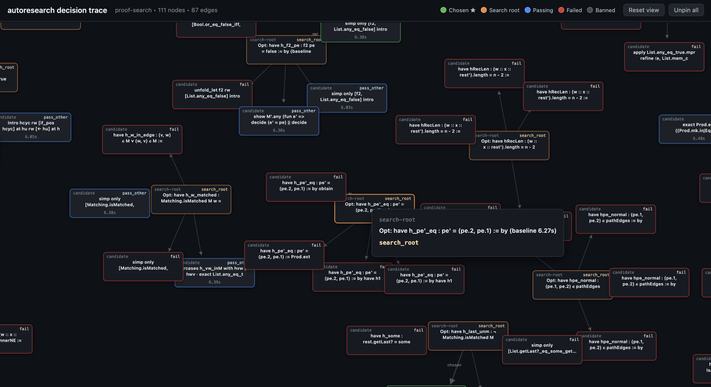
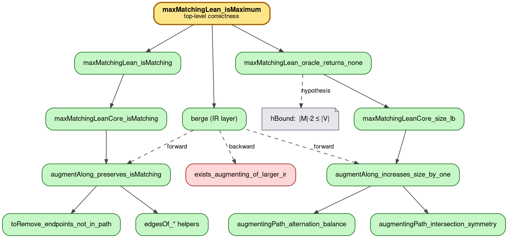
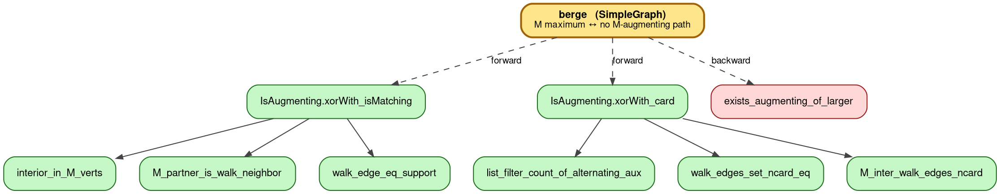
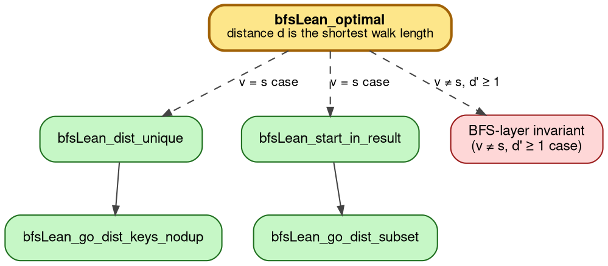
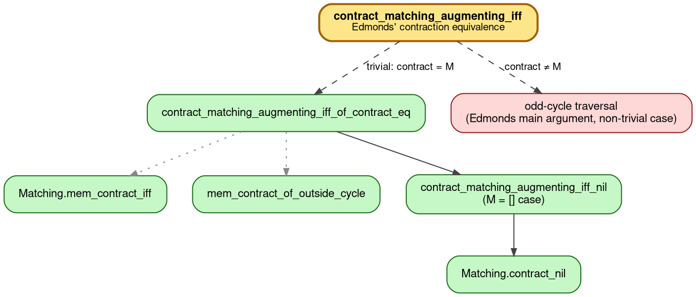
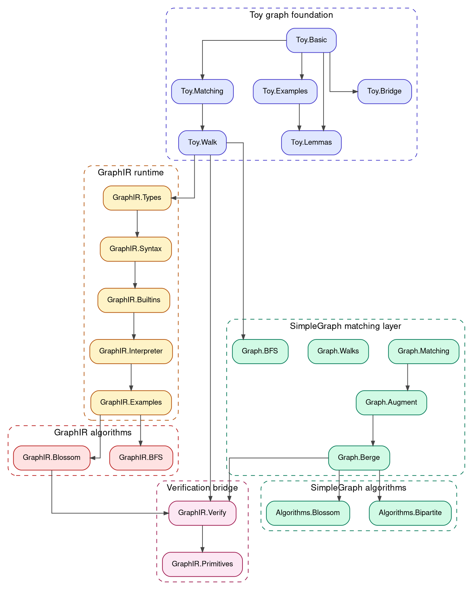

# Formalizing Edmonds' Blossom in Lean 4

Solution submitted by **Team Blossom** for the **UW Lean Hackathon 2026**.

## Edmonds' Blossom Algorithm in GraphIR

```text
MaxMatching():
  let G  = graph_value_ofCtx()       -- reify the ambient graph as a value
  let M0 = matching_empty()
  return MaxMatchingLoop(G, M0)

MaxMatchingLoop(G, M):
  match FindAugmentingPath(G, M) with
  | some P => let M' = augment(M, P) in MaxMatchingLoop(G, M')
  | none   => M

FindAugmentingPath(G, M):
  let F = alternating_forest(G, M)
  match search_even_even_edge(G, M, F) with
  | AugmentingPath P =>
      some P
  | Blossom B =>                                            -- <-- THE recursion
      let G' = graph_value_contract(G, B)
      let M' = contract_matching(M, B)
      match FindAugmentingPath(G', M') with                 -- <-- on contracted graph
      | some P' => some (lift_path(G, M, B, P'))
      | none    => none
  | NoPath => none
```

### How to read this

- **Program state.** GraphIR's runtime context carries the **graph** as a first-class value (`G`, threaded through every call) and the **matching** `M` as a list of `(V × V)` edges. `graph_value_ofCtx()` lifts the ambient graph from the runtime `Context` into a value; `graph_value_contract(G, B)` returns a new graph with blossom `B` collapsed; `graph_value_vertices(G)`, `graph_value_neighbors(G, v)`, etc., are first-class operations on graphs *as values*.
- **Keywords.** `let x = e in …` is a binding, `match _ with` is pattern matching, `some / none / Blossom / AugmentingPath / NoPath` are tagged-constructor patterns, `f(args)` is a function call.
- **Semantics, in one line.** A fuel-based small-step interpreter ([`Interpreter.lean`](Hackathon/GraphIR/Interpreter.lean)) walks the AST: each `let` extends the environment, each `match` destructures, each `f(args)` looks up a `FunDecl` and reduces with one fuel unit. Stuck terms (type errors) become interpreter `none`s.
- **What's real vs. stubbed in the program above.** The control-flow functions — `MaxMatching`, `MaxMatchingLoop`, `FindAugmentingPath` (including the recursion on the contracted graph) — are written from scratch in GraphIR. The graph-as-value plumbing — `graph_value_ofCtx`, `graph_value_contract`, `matching_empty` — is real, implemented in [`Builtins.lean`](Hackathon/GraphIR/Builtins.lean). `augment` and `contract_matching` are stubs here but have **fully verified** GraphIR implementations in [`Primitives.lean`](Hackathon/GraphIR/Primitives.lean) (proved equivalent to Lean references via `augment_correct_spec` / `contract_matching_correct_spec`). The search primitives — `alternating_forest`, `search_even_even_edge`, `lift_path` — are stubs to be filled in as the next milestone.
- **The headline correctness theorem in Lean** ([`Hackathon/GraphIR/Blossom.lean`](Hackathon/GraphIR/Blossom.lean)):

  ```lean
  theorem maxMatchingLean_isMaximum
      (ctx : Context V) (spec : OracleSpec ctx)
      (hBound : (maxMatchingLean ctx).size * 2 ≤ ctx.vertices.length) :
      IsMaximumMatching ctx (maxMatchingLean ctx)
  ```

  *The algorithm returns a matching no other matching can beat.* The actual IR encoding lives in `blossomFuns` in [`Hackathon/GraphIR/Blossom.lean`](Hackathon/GraphIR/Blossom.lean).


[](http://owenparks.com/autoresearch-trace/blossom/)

## Why this matters

- **First Lean formalization of Edmonds' blossom algorithm.** To our knowledge, no prior work in Lean 4 (or Lean 3) has formalized the *correctness* of Edmonds' algorithm end-to-end; only fragments of underlying matching theory exist in Mathlib.
- **Backend-agnostic by design.** Because the algorithm is written in **GraphIR** — a small typed IR with its own operational semantics — the correctness proof transfers to *any* execution backend (C, Rust, OCaml, native Lean, …) as soon as a translation respects the IR semantics. We prove correctness *once*, against the IR's reference interpreter.
- **A reusable verified-IR workflow.** The split between a *runnable IR program* and a *pure-Lean reference* (`maxMatchingLean`), bridged by `*_correct_spec` theorems in [`Primitives.lean`](Hackathon/GraphIR/Primitives.lean), is a general recipe: any new graph algorithm coded in GraphIR can be verified by reducing IR-level correctness to Lean-level proofs.

## What's Proved

- **Berge's theorem (forward direction)** — closed via the augmentation lemma `IsAugmenting.xorWith_isMatching` + `IsAugmenting.xorWith_card`. *M maximum ⇒ no augmenting path.*
- **Loop termination** — `maxMatchingLean_oracle_returns_none` proves the bounded loop exits when no augmenting path remains, given the size bound `|M|·2 ≤ |V|`.
- **GraphIR ↔ Lean reference equivalence** — `augment_correct_spec`, `contract_matching_correct_spec` prove that the IR implementations compute the same matchings as their pure-Lean references.
- **BFS soundness** — `bfsLean_sound` shows every BFS-returned `(v, d)` corresponds to a real walk of length `d`.

Build status: **3346 / 3346 jobs clean**, **4 remaining `sorry`s** (all research-level: Berge backward in both layers, BFS optimality `v ≠ s, ¬G.edge s v` case, Edmonds' blossom-contraction equivalence). Each has structural helpers in place.

## Compilation

```bash
lake update     # one-time: fetch deps and Mathlib build cache
lake build      # 3346 jobs, clean
./scripts/measure-build.sh   # build + report sorries + write build-report.json
```

`measure-build.sh` is the signal consumed by the autoresearch loop.

## Proof Structure (IR layer)

`maxMatchingLean_isMaximum` reduces through Berge + loop-termination obligations down to proved augmentation-side lemmas. **Green** = proved, **red** = remaining `sorry`, **yellow** = main theorem.



## Proof Structure (SimpleGraph layer + BFS + blossom)

Mathlib-side Berge's theorem with `xorWith_isMatching` / `xorWith_card` proved:



BFS optimality (multiple cases closed; remaining case has all helpers staged):



Edmonds' blossom-contraction equivalence (trivial `M.contract B = M` case closed):



## Autoresearch Pipeline

To accelerate proof development we built an **autoresearch loop** — a fully-automated system that both *closes open `sorry` placeholders* and *optimises compile time* of existing proofs, without human intervention. In one recent run, the loop reviewed 24 proof blocks in `Blossom.lean` and improved 8 of them (baseline 6.27 s → 6.20 s) — typical refinements substitute named intermediates to help the unifier or inline `Prod.ext` calls, each a small but machine-verified tactic refinement.

Run with:
```bash
python scripts/autoresearch.py [target]            # sorry-filling mode
python scripts/autoresearch.py --optimize <file>   # optimize mode
python scripts/autoresearch_with_forcegraph.py --optimize <file>  # with D3 decision graph
```

### How it works

**Sorry-filling mode** scans every `.lean` file for tactic-mode `sorry` placeholders, extracts the live Lean *proof goal state* by temporarily injecting `trace_state` and compiling, asks Claude (Anthropic) for 3–5 candidate proof tactics, evaluates every candidate with `lake env lean`, ranks passing candidates by a **proof quality score**, and writes the best one back.

**Optimize mode** measures baseline compile time, asks Claude for refactored alternatives of each complete tactic proof block (e.g., replacing bare `simp` with `simp only [...]`, extracting reasoning into named `have` blocks), ranks by the same quality score, and accepts a change only if the new proof scores strictly better *and* introduces no new compile errors.

### Proof quality score

Lower is better — biases the model toward readable, compositional proofs rather than proof-golfed one-liners:

```
score = 0.1 × compile_time
      + 2.0 × automation_cost    # penalise simp / aesop / decide / omega
      − 1.5 × structure_bonus    # reward have / exact / calc / rcases / refine
      + brevity_penalty           # mild penalty for one-liners
```

### Decision-trace visualisation

Every run writes `proof-search.html` — an interactive force-directed graph showing exactly which candidates were tried, why each failed or passed, and why the chosen proof was selected.

[](http://owenparks.com/autoresearch-trace/blossom/)

| Colour | Meaning |
|---|---|
| 🟠 Orange | Search root (the `sorry` / theorem being worked on) |
| 🟢 Green ★ | Chosen proof — best quality score |
| 🔵 Blue | Passing candidate not selected |
| 🔴 Red | Failed to compile |
| ⚫ Grey | Banned (`sorry` / `admit` / `native_decide`) |

Hover any node for the full proof text, quality score, compile time, and error message. Every `--optimize` run also writes a timestamped Markdown log to `logs/`.

## Project Structure

The codebase is layered: toy graph foundation → SimpleGraph matching theory → GraphIR runtime → GraphIR algorithms → verification bridge.



```
Hackathon/
├── Graph/                       — SimpleGraph (Mathlib) layer
│   ├── Matching.lean            — IsAugmenting, IsAlternating
│   ├── Augment.lean             — xorWith, the augmentation lemma
│   ├── Berge.lean               — Berge's theorem
│   ├── Walks.lean               — walk lemmas
│   ├── Toy/                     — toy graph framework + bridge to Mathlib
│   └── Algorithms/
│       ├── Bipartite.lean       — Hungarian / Hopcroft–Karp scaffold
│       └── Blossom.lean         — Edmonds scaffold
├── GraphIR/                     — Custom intermediate representation
│   ├── Syntax.lean              — Expr / FunDecl / Program
│   ├── Types.lean               — Val and ValType
│   ├── Builtins.lean            — Context, primitive operations (graph_value_*)
│   ├── Interpreter.lean         — small-step evaluator with fuel
│   ├── Primitives.lean          — IR ↔ Lean equivalence proofs
│   ├── BFS.lean                 — BFS reference + soundness
│   ├── Blossom.lean             — blossom algorithm IR + correctness
│   ├── Verify.lean              — top-level reduction theorems
│   └── Examples.lean            — runnable example programs
└── Exercises/                   — pedagogical warm-ups (closed)
```

## Contributors

- **John Ye** — [GitHub](https://github.com/yezhuoyang) | [Website](https://yezhuoyang.github.io/)
- **Nicholas Mundy** — [GitHub](https://github.com/nmmundy)
- **Kieran Rullman** — [GitHub](https://github.com/kieranrullman)
- **Owen Parks** — [GitHub](https://github.com/oe-parks) | [Website](https://owenparks.com)
